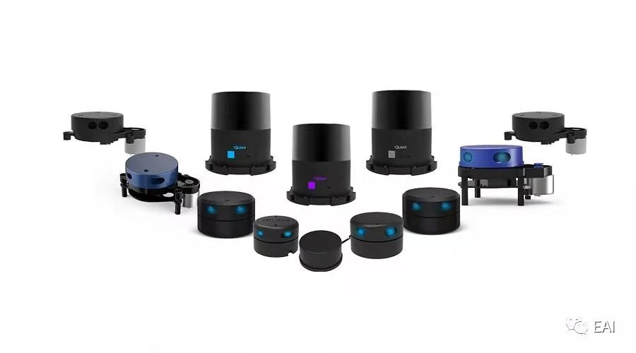

# YDLidar ROS2 Workspace



Türkçe / [English](#english-version)

## 📋 Proje Açıklaması

Bu repository, **YDLidar X2** cihazını **ROS2 Humble** ortamında kullanmak için gerekli tüm kurulum ve konfigürasyon adımlarını içeren bir ROS2 workspace'idir. 

YDLidar, ucuz ve güvenilir 2D LIDAR çözümü sunan bir sensör cihazıdır. Bu proje, cihazı ROS2'ye entegre etmek için gereken tüm adımları basitleştirmek amacıyla hazırlanmıştır.

---

## 🚀 Hızlı Başlangıç

### Sistem Gereksinimleri

- **İşletim Sistemi**: Ubuntu 20.04 LTS veya Ubuntu 22.04 LTS
- **ROS2 Sürümü**: Humble
- **CMake**: 3.8 veya üzeri
- **Python**: 3.8 veya üzeri
- **Bağlantı**: YDLidar cihazı USB üzerinden bağlantılı olmalı

### 1️⃣ ROS2 Kurulumu

ROS2 Humble'ı henüz kurmadıysanız, resmi ROS2 kurulum kılavuzunu izleyin:

```bash
# Ubuntu paket sunucularını yapılandırın
sudo apt update
sudo apt install software-properties-common
sudo add-apt-repository universe

# ROS GPG anahtarını ekleyin
sudo apt install curl
curl -sSL https://raw.githubusercontent.com/ros/rosdistro/master/ros.key | sudo apt-key add -

# ROS2 paketlerini ekleyin
sudo apt update
sudo apt install ros-humble-desktop
```

Detaylı kurulum için: [ROS2 Humble Kurulum Kılavuzu](https://docs.ros.org/en/humble/Installation.html)

### 2️⃣ YDLidar SDK Kurulumu

YDLidar sürücüsü, YDLidar-SDK kütüphanesine bağımlıdır. İlk olarak bunu kurmalısınız:

```bash
# Depoyu klonlayın
cd ~/
git clone https://github.com/YDLIDAR/YDLidar-SDK.git

# Build dizinine girin ve derleyin
cd YDLidar-SDK
mkdir build
cd build
cmake ..
make
sudo make install
```

> ⚠️ **Önemli**: YDLidar-SDK kurulumu tamamlanmazsa, ROS2 driver derlenirken hata oluşacaktır.

### 3️⃣ ROS2 Workspace'i Hazırlayın

```bash
# Workspace oluşturun
mkdir -p ~/ydlidar_ros2_ws/src
cd ~/ydlidar_ros2_ws

# Bu repository'yi klonlayın
git clone https://github.com/Mertsr/ydlidar_ros2_ws.git .
```

### 4️⃣ Gerekli Araçları Yükleyin

```bash
# colcon build aracını kurun
sudo apt install python3-colcon-common-extensions

# ROS2 test araçlarını kurun
sudo apt install ros-humble-launch-testing-ament-cmake
```

### 5️⃣ Workspace'i Derleyin

```bash
cd ~/ydlidar_ros2_ws

# Workspace'i derleyin
colcon build --symlink-install
```

🎉 Başarılı derlemeden sonra `install` klasörü oluşturulacaktır.

### 6️⃣ Ortam Değişkenlerini Ayarlayın

Her yeni terminal penceresinde ROS2 ortam değişkenlerini yüklemeniz gerekir:

```bash
source ~/ydlidar_ros2_ws/install/setup.bash
```

**Otomatik Yükleme** (Önerilen):

```bash
echo "source ~/ydlidar_ros2_ws/install/setup.bash" >> ~/.bashrc
source ~/.bashrc
```

---

## 🔌 Donanım Kurulumu

### Seri Port Konfigürasyonu

YDLidar cihazının seri porta doğru şekilde erişebilmesi için:

```bash
# Startup scriptlerini çalıştırılabilir yapın
chmod +x src/ydlidar_ros2_driver/startup/*

# Sistem kurulumunu yapın
sudo sh src/ydlidar_ros2_driver/startup/initenv.sh

# Cihazı yeniden takın
# (Cihazı USB portundan çıkarıp tekrar takın)
```

### Seri Port Doğrulaması

Cihazınızın seri porta bağlı olup olmadığını kontrol edin:

```bash
# Mevcut seri portları listeleyin
ls /dev/tty* | grep USB

# Veya
dmesg | tail -20
```

Çıktı şöyle görünmelidir:
- `/dev/ttyUSB0` veya `/dev/ydlidar` (setup script çalıştırılmışsa)

---

## ⚙️ Konfigürasyon

### Parametreler Dosyası

YDLidar parametreleri `src/ydlidar_ros2_driver/params/ydlidar.yaml` dosyasında tanımlanır:

```yaml
ydlidar_ros2_driver_node:
  ros__parameters:
    port: /dev/ttyUSB0          # Seri port adresi
    frame_id: laser_frame        # TF frame ismi
    baudrate: 230400            # Baud hızı
    lidar_type: 1               # 0=TOF, 1=TRIANGLE, 2=TOF_NET
    device_type: 0              # 0=SERIAL, 1=TCP, 2=UDP
    sample_rate: 9              # Örnek alma hızı
    frequency: 10.0             # Tarama frekansı (Hz)
    angle_min: -180.0           # Minimum açı
    angle_max: 180.0            # Maximum açı
    range_min: 0.01             # Minimum mesafe
    range_max: 64.0             # Maximum mesafe
    inverted: true              # Ters dönüş (true=CCW)
    auto_reconnect: true        # Otomatik yeniden bağlan
```

**Yaygın Ayarlamalar:**

| Parametre | Açıklama | Varsayılan |
|-----------|----------|-----------|
| `port` | Cihaz bağlantısı (ör. `/dev/ttyUSB0`) | `/dev/ydlidar` |
| `frequency` | Tarama hızı (5-12 Hz önerilen) | `10.0` |
| `angle_min/max` | Açı sınırlaması | -180 / 180 |
| `range_min/max` | Mesafe sınırlaması | 0.01 / 64.0 |
| `inverted` | Saat yönü tersine dönüş | `true` |

---

## 🎯 Sürücü Çalıştırma

### Temel Başlatma

```bash
# Ortam değişkenlerini yükleyin
source ~/ydlidar_ros2_ws/install/setup.bash

# Varsayılan parametrelerle çalıştırın
ros2 launch ydlidar_ros2_driver ydlidar.py
```

### Konfigürasyon Dosyasıyla Başlatma

```bash
ros2 launch ydlidar_ros2_driver ydlidar_launch.py
```

### RViz Görselleştirme ile Başlatma

```bash
ros2 launch ydlidar_ros2_driver ydlidar_launch_view.py
```

RViz açılacak ve LIDAR taraması gerçek zamanlı görselleştirilecektir.

### Tarama Verilerini İnceleme

Başka bir terminal penceresinde:

```bash
source ~/ydlidar_ros2_ws/install/setup.bash

# Scan topic'ini dinleyin
ros2 topic echo /scan
```

---

## 📊 ROS2 Topics ve Services

### Yayınlanan Topics

| Topic | Tip | Açıklama |
|-------|-----|----------|
| `/scan` | `sensor_msgs/LaserScan` | 2D lazer tarama verileri |

### Hizmetler (Services)

| Service | Tip | İşlev |
|---------|-----|-------|
| `/start_scan` | `std_srvs/Empty` | LIDAR'ı başlat |
| `/stop_scan` | `std_srvs/Empty` | LIDAR'ı durdur |

**Hizmet Çağrısı Örneği:**

```bash
# Taramayı durdur
ros2 service call /stop_scan std_srvs/srv/Empty

# Taramayı başlat
ros2 service call /start_scan std_srvs/srv/Empty
```

---

## 🐛 Sorun Giderme

### ❌ "Permission denied" hatası

Eğer `/dev/ttyUSB0` erişim hatası alırsanız:

```bash
sudo usermod -a -G dialout $USER
sudo reboot
```

### ❌ "YDLidar-SDK bulunamadı" hatası

SDK'nın yüklü olmadığını gösterir:

```bash
# SDK'yı kontrol edin
pkg-config --modversion ydlidar

# Eğer bulunamazsa, tekrar yükleyin
cd ~/YDLidar-SDK/build
sudo make install
```

### ❌ Cihaz bağlanmıyor

1. **Bağlantıyı kontrol edin:**
   ```bash
   lsusb | grep -i lidar
   ```

2. **Doğru port adresini kullanın:**
   ```bash
   ls -la /dev/ttyUSB*
   ```

3. **Setup scriptini tekrar çalıştırın:**
   ```bash
   sudo sh src/ydlidar_ros2_driver/startup/initenv.sh
   ```

### ❌ RViz'de veri görülmüyor

- Tarama topic'inin doğru olduğundan emin olun: `/scan`
- `frame_id` parametresinin konsistent olduğundan emin olun
- `frequency` parametresini arttırmayı deneyin

---

## 📦 Proje Yapısı

```
ydlidar_ros2_ws/
├── src/
│   └── ydlidar_ros2_driver/
│       ├── launch/              # ROS2 launch dosyaları
│       ├── params/              # Konfigürasyon dosyaları
│       ├── startup/             # Sistem kurulum scriptleri
│       └── ...
├── install/                     # Derlenmiş çıktı (build sonrası)
├── build/                       # Build dosyaları (build sonrası)
└── README.md
```

---

## 📚 Kaynaklar

- [ROS2 Resmi Dokümantasyonu](https://docs.ros.org/en/humble/)
- [YDLidar Resmi Sitesi](http://www.ydlidar.cn/)
- [YDLidar GitHub Repository](https://github.com/YDLIDAR/YDLidar-SDK)
- [ROS2 Colcon Build Sistemi](https://colcon.readthedocs.io/)

---

## ✅ Başarılı Kurulum Kontrol Listesi

- [ ] ROS2 Humble kuruldu
- [ ] YDLidar-SDK kuruldu ve yüklendi
- [ ] Workspace klonlandı
- [ ] `colcon build --symlink-install` başarıyla çalıştı
- [ ] `setup.bash` dotfiles'a eklendi
- [ ] YDLidar cihazı USB'ye bağlı
- [ ] Seri port konfigürasyonu yapıldı
- [ ] `ros2 launch ydlidar_ros2_driver ydlidar_launch_view.py` çalıştı
- [ ] RViz'de tarama verileri görülüyor

---

## 📝 Lisans

Bu proje YDLidar-SDK ve ROS2 Community projeleri üzerine kurulmuştur.

---

## 💬 İletişim & Destek

Sorularınız varsa:
- GitHub Issues sekmesini kullanın
- YDLidar Resmi İletişim: [www.ydlidar.cn/cn/contact](http://www.ydlidar.cn/cn/contact)

---

<a name="english-version"></a>

# YDLidar ROS2 Workspace

[Türkçe](#-proje-açıklaması)

## 📋 Project Description

This repository contains a complete ROS2 workspace setup for using the **YDLidar X2** sensor with **ROS2 Humble**. YDLidar is an affordable and reliable 2D LIDAR sensor solution. This project simplifies the integration process.

### Quick Start

#### 1. Prerequisites

- Ubuntu 20.04 LTS or 22.04 LTS
- ROS2 Humble
- USB connection to YDLidar device

#### 2. Install YDLidar SDK

```bash
git clone https://github.com/YDLIDAR/YDLidar-SDK.git
cd YDLidar-SDK && mkdir build && cd build
cmake .. && make && sudo make install
```

#### 3. Setup Workspace

```bash
mkdir -p ~/ydlidar_ros2_ws/src
cd ~/ydlidar_ros2_ws
git clone https://github.com/Mertsr/ydlidar_ros2_ws.git .
```

#### 4. Build

```bash
sudo apt install python3-colcon-common-extensions
colcon build --symlink-install
source install/setup.bash
```

#### 5. Run

```bash
ros2 launch ydlidar_ros2_driver ydlidar_launch_view.py
```

---

**Detailed documentation available in Turkish above.**
